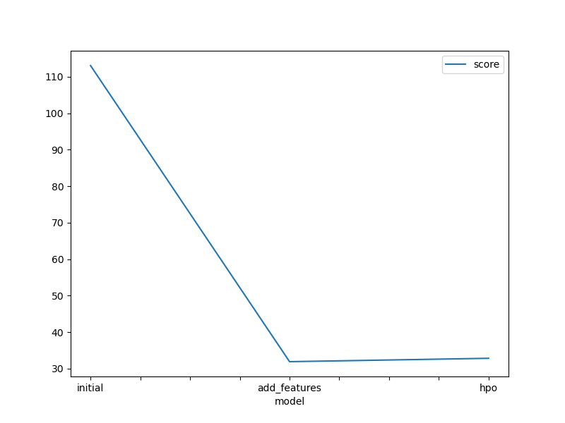
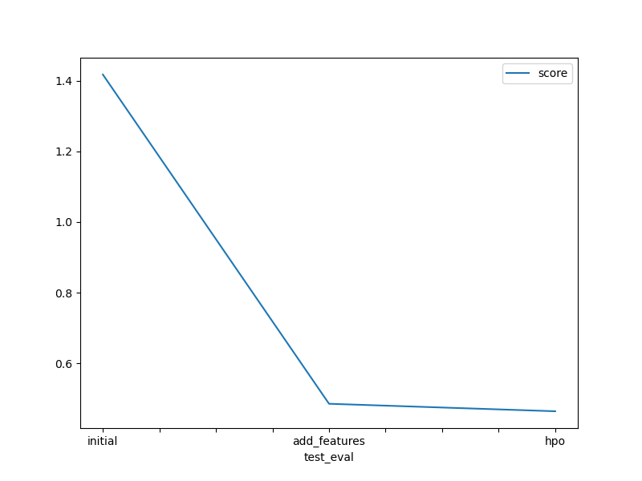

# Report: Predict Bike Sharing Demand with AutoGluon Solution
#### Cesar James Muñoz Martinez

## Initial Training
### What did you realize when you tried to submit your predictions? What changes were needed to the output of the predictor to submit your results?
When I tried to submit my predicts, because my results had many negative values that needed to be corrected, Kaggle output an error.

### What was the top ranked model that performed?
WeightedEnsemble_L3 was the top-performing model, achieving the best RMSE score of −31.940849.

## Exploratory data analysis and feature creation
### What did the exploratory analysis find and how did you add additional features?
In the exploratory analysis I found that adding new derived features like year, month, day, weekday, hour, rush_hour, temp_category, is_very_windy and is_very_humid and converting the season and weathers columns to categorical data type, the model performed better.

### How much better did your model perform after adding additional features and why do you think that is?
The model performed significantly better after adding the additional features mentioned previously. These features provided the model with much more information, leading to improved performance.

## Hyper parameter tuning
### How much better did your model preform after trying different hyper parameters?
The model perfomed slightly worse that the previous model.

### If you were given more time with this dataset, where do you think you would spend more time?
If I were given more time with this dataset, I would spend more time on feature engineering to identify the best model during the validation stage, as well as on hyperparameter tuning to optimize the selected model’s parameters.

### Create a table with the models you ran, the hyperparameters modified, and the kaggle score.
|model|NN|GBM|CATB|XGB|RF|score|
|--|--|--|--|--|
|initial|default|default|default|default|default|1.4457|
|add_features|default|default|default|default|default|0.4738|
|hpo|NN Tunning|GBM Tuning|CATB Tuning|XGB Tuning|RF Tuning|0.500|

### Create a line plot showing the top model score for the three (or more) training runs during the project.

### Create a line plot showing the top kaggle score for the three (or more) prediction submissions during the project.

## Summary
The machine learning model development workflow is inherently iterative, with exploratory data analysis and feature engineering playing a critical role in overall model performance. Furthermore, hyperparameter tuning can have a significant positive or negative impact on performance metrics.

